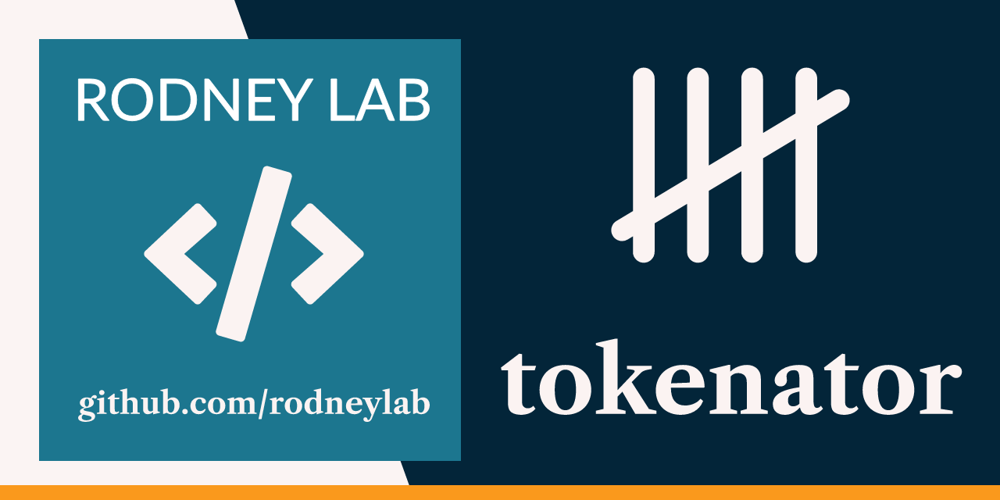

  

<h1 align="center">
  tokenator
</h1>

**Count LLM prompt tokens to fine-tune prompts**

> **Warning** 🚧 Work in progress

## License

The project is licensed under BSD 3-Clause License — see the [LICENSE](./LICENSE) file for details.
